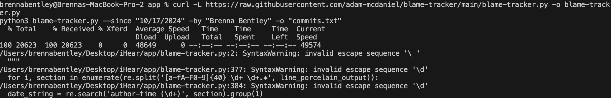

# Sprint 3

## Info

- Name: Brenna Bentley
- NetID: bbentle4
- GithubID: bbentley4
- Group name: iHear

## What I planned to do

- Front end: 
    - Improve the reporting page UI
    - Resolve reporting page bugs (see issue [41](https://github.com/utk-cs340-fall24/iHear/issues/41))
    - Improve the profile page UI
    - Add features to the profile page (see issue [40](https://github.com/utk-cs340-fall24/iHear/pull/63)) 
    - Change the tabs on the bottom to a drawer with a 'hamburger' menu (see issue [49](https://github.com/utk-cs340-fall24/iHear/issues/49))

## What I did not complete

- **The scope of issue 40 has been expanded**
    -Increase the size of the avatar a little bit.
    -Remove the title "PROFILE" because we have it in Drawer and Stack navigator now.
    -Change text "Contact (email)" to "Email"
    -Change text "Contact (phone)" to "Phone"
    -Make field and value in-line together to save space. Example:
        `Name: Leon Hoang
        NetID: phoang5`
    -In crease the font-size a little bit because we have much more space now.
    -Do not let the screen to be scrollable, just static. We don't have any other information to show.
    -Disable all input fields (read-only). We will add edit function later.

- The Report page still is giving a warning in the photo upload.
- The Report page still needs to be able to allow the user to choose a photo album to meet the acceptance criteria for the issue.

## What problems you encountered

- Team's limited velocity: Although the team lead prepared many tasks, some members only took one easy task, or none.
- Team's limited communication: Some members do not communicate about their progress or at all.
These two issues caused many of my own issues as myself and another team member ended up working on the same feature. 
It also meant dependencies for the database that I needed done to complete some other front end tasks I wanted to pick up, I could not.

- **GITBLAME**
Git blame gave me such a headache
You can see I tried the gitblame tracker and got errors. When I ignore the errors, I get nothing.

Then you can see I tried a couple different methods of gitblame and got different results, neither of which followed the parameters I set

## What issue I worked on

- [#40](https://github.com/utk-cs340-fall24/iHear/issues/40): Improve Report Page
- [#41](https://github.com/utk-cs340-fall24/iHear/issues/41): Improve Profile Page
- [#49](https://github.com/utk-cs340-fall24/iHear/issues/49): Reconstruct tabs to drawers

## Files that I worked on

- Note: Only my work from issue 49 is on the main branch due to not achieving the acceptance criteria. I've listed the respective branches.  
- main: Issue 49
    - _layout.tsx
    - app/(auth)/dashboard.tsx
    - app/(auth)/profilepage.tsx
    - app/(auth)/report.tsx
    - app/(auth)/ticketdetails.tsx
- issue-41: Issue 41
    - app/(auth)/report.tsx
- issue-40: Issue 40
    - app/(auth)/profilepage.tsx

## What I accomplished

- The issues assigned to me. 
- Spoke to the team lead and a teammate about Sprint 4 and how to finish our project by the deadline.

